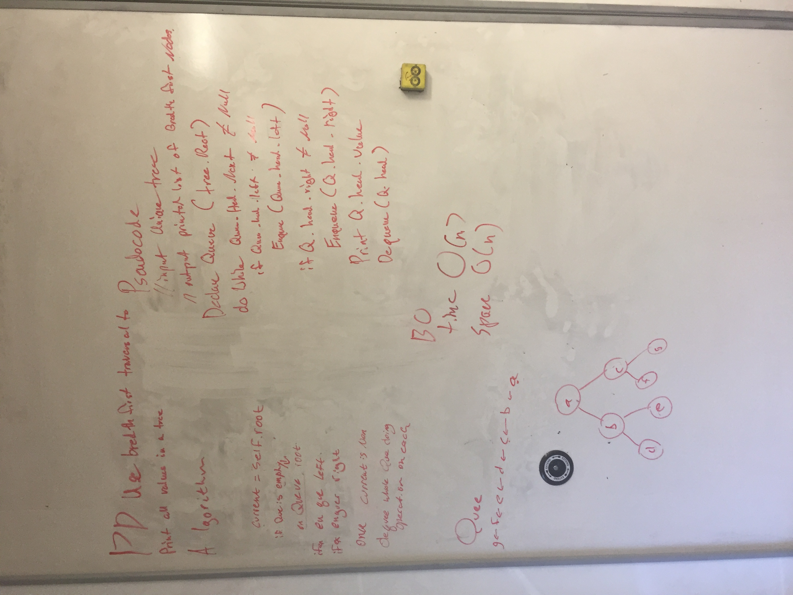

## Overview
Four score and 7 years ago our forefathers brought upon this continent a new nation, concieved in liberty and dedicated to the proposition that all men are created equal. Now we are engaged in a great struggle, testing whether this nation, or any nation so concieved and so dedicated and can traverse through a binary in a 'breadth first manner', printing our each value in that order.

## Note
I added an array that each value is appended to for testing purposes and returned it.

##

