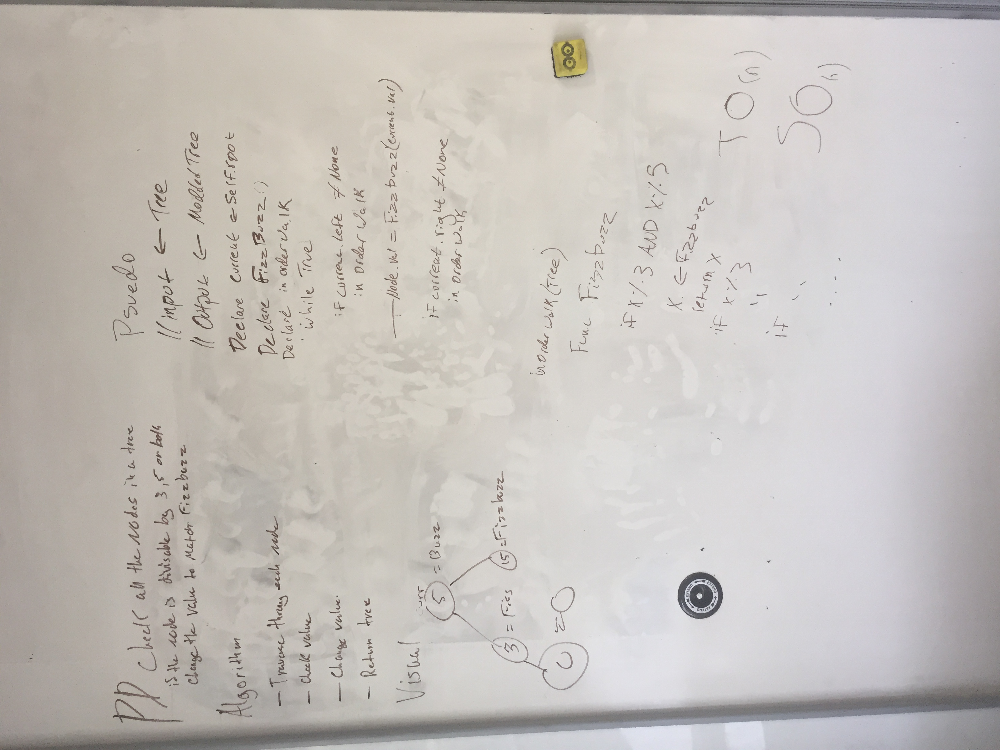

# Overview
I once met a goat who could talk. He didn't say much at the time, but I left my phone number with him in case he ever felt like calling. Just yesterday I finally heard from him. He said this:

## Challenge
'ahhrrrrrr, write a function called FizzBuzzTree which takes a tree as an argument. without utilizing any of the built-in methods available to your language, determine weather or not the value of each node is divisible by 3, 5 or both, and change the value of each of the nodes respectively. Return the tree with it’s news values. Thanks for the paper it was delicious'

Solution
