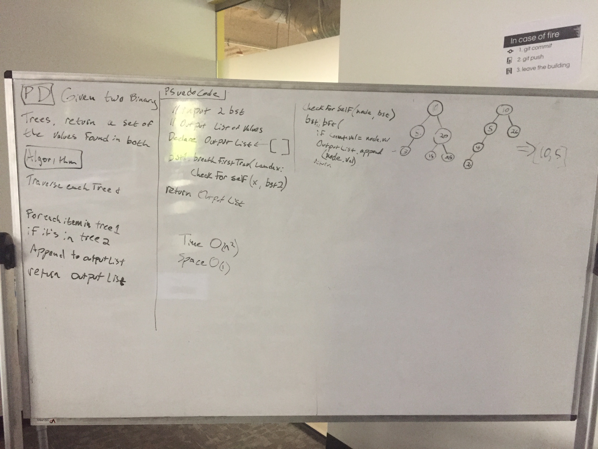

# Overview
If a ton of crumbs and a scrum of buns made a son, it might one day ask me to do the following:

## Challenge
Write a function called tree_intersection that takes two binary tree parameters. Without utilizing any of the built-in library methods available to your language, return a set of values found in both trees.

## Solution

