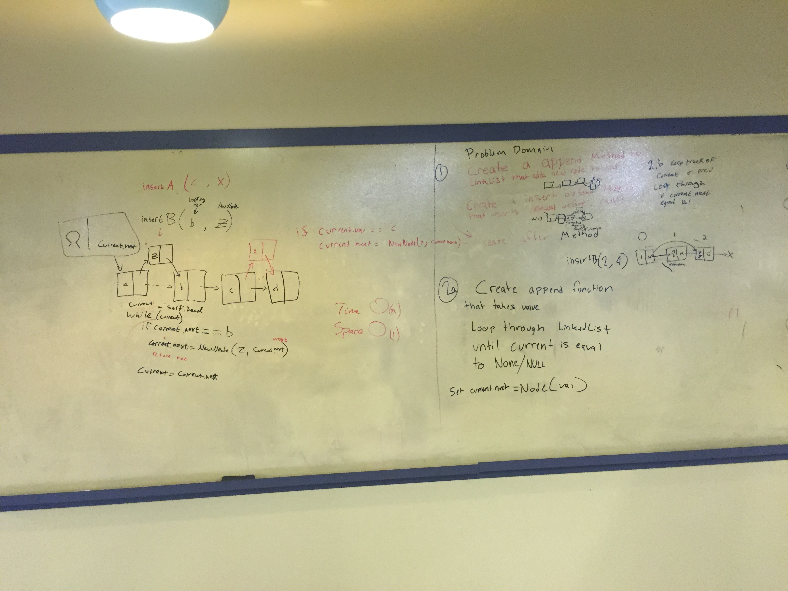

## Overview
I'm about to fall asleep because I'm very tired but I ghost looking like scott drifts up to me on my couch.

## Challenge
'Oooooooo, make these method for the linked list file:
* .append(value) which adds a new node with the given value to the end of the list
* .insertBefore(value, newVal) which add a new node with the given newValue immediately before the first value node
* .insertAfter(value, newVal) which add a new node with the given newValue immediately after the first value node'

## Solution

