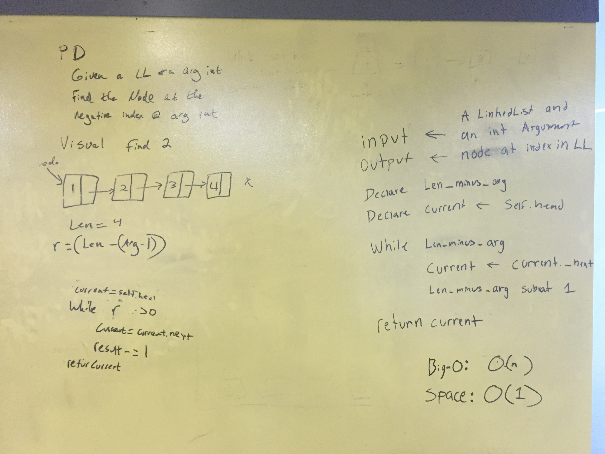

## Overview
I'm about to fall asleep because I'm very tired but I ghost looking like scott drifts up to me on my couch.

## Challenge
'Oooooooo, make these method for the linked list file:
* .append(value) which adds a new node with the given value to the end of the list
* .insertBefore(value, newVal) which add a new node with the given newValue immediately before the first value node
* .insertAfter(value, newVal) which add a new node with the given newValue immediately after the first value node'

## Solution

## Overview - Kth From End
I am out at the farmers market checking out a nice loaf of bread when it sprouts a mouth and speaks to me.

## Challenge
'Hey you, hungry human guy. Write a method for the Linked List class called kthFromEnd which takes a number, k, as an argument. Return the node that is k from the end of the linked list. Also buy me. I'm great with butter!'

## Solution

## Overview - Merge Lists
It's lunch and I've decided to sun myself on my favorite rock in Seattle center. A socialized yound squirrel bounds up to me and issues me the following challenge.

## Challenge
'Churrk. Hey you. You there. Write a function called mergeLists which takes two linked lists as arguments. Zip the two linked lists together into one so that the nodes alternate between the two lists and return a reference to the head of the single list. Try and keep additional space down to O(1). You have access to the Node class and all the properties on the Linked List class as well as the methods created in previous challenges. Thanks! Can I have your sandwich?'

## Solution

