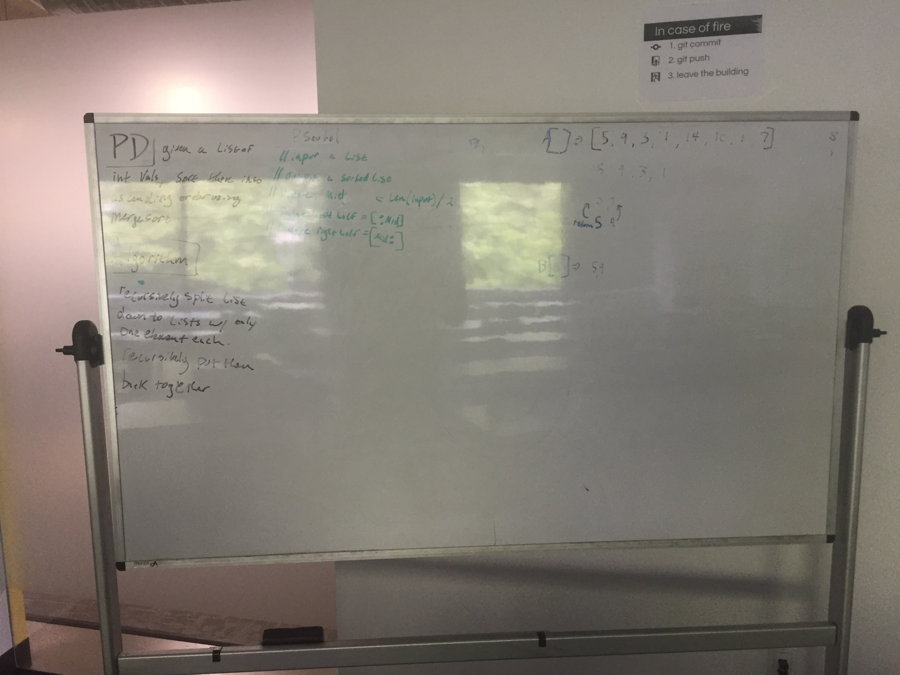

## Overview
If you've never made chia pudding before then you're in for a treat! My husband and I have been creating these tasty little snacks for years now and we still love it. Simply take a few tablespoons of chia seeds and drop then in 8 ounces of your favorite milk or milk substitute in a mason jar. Then add a dash of vanilla extract, sugar or sugar substitue, almonds or anything else that strikes your fancy (Craig loves dried blueberries, yum!). Finally seal it up and leave it in the fridge overnight and in the morning you'll be greeted by a healthy and delicious way to start your day!
For more recipes, like how to do a recursive mergesort on an unstorted list, checkout the info below!

## Challenges
* Write a function that accepts an array of unsorted integers, and returns a sorted array by a recursive mergesort algorithm.
* Utilize the Single-responsibility principle: any methods you write should be clean, reusable, abstract component parts to the whole challenge. You will be given feedback and marked down if you attempt to define a large, complex algorithm in one function definition.
* Write at least three test assertions for each method that you define.

## Resources Used
* http://interactivepython.org/courselib/static/pythonds/SortSearch/TheMergeSort.html
* https://visualgo.net/bn/sorting

## Solution

